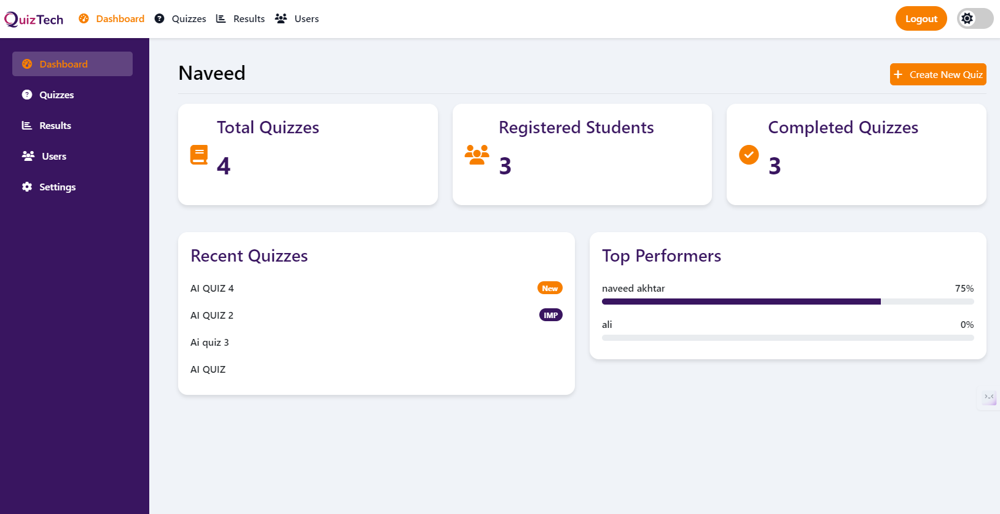

# QuizTech


## About QuizTech

QuizTech is a web application designed to facilitate the creation, management, and participation in quizzes. Built on the Laravel framework, it provides a robust and user-friendly interface for both quiz creators and participants.

## Features

- **User Authentication**: Secure login and registration for users.
- **Quiz Creation**: Easy-to-use interface for creating quizzes with multiple question types.
- **Real-time Results**: Participants can view their scores immediately after completing a quiz.
- **Leaderboard**: Display top scores to encourage competition among users.
- **Responsive Design**: Fully responsive layout for optimal viewing on all devices.
- **Extensive Documentation**: Comprehensive guides and tutorials to help users get started.

## Screenshot




## Installation

To install QuizTech, follow these steps:

1. Clone the repository:
   ```bash
   git clone https://github.com/nav69eed/quiztech-app.git
   ```

2. Navigate to the project directory:
   ```bash
   cd quiztech-app
   ```

3. Install dependencies:
   ```bash
   composer install
   ```

4. Set up your environment file:
   ```bash
   cp .env.example .env
   ```

5. Generate the application key:
   ```bash
   php artisan key:generate
   ```

6. Run migrations:
   ```bash
   php artisan migrate
   ```

7. Start the local development server:
   ```bash
   php artisan serve
   ```

## Contributing

We welcome contributions to QuizTech! Please read our [contributing guidelines](https://laravel.com/docs/contributions) for more information.

## License

QuizTech is open-sourced software licensed under the [MIT license](https://opensource.org/licenses/MIT).
